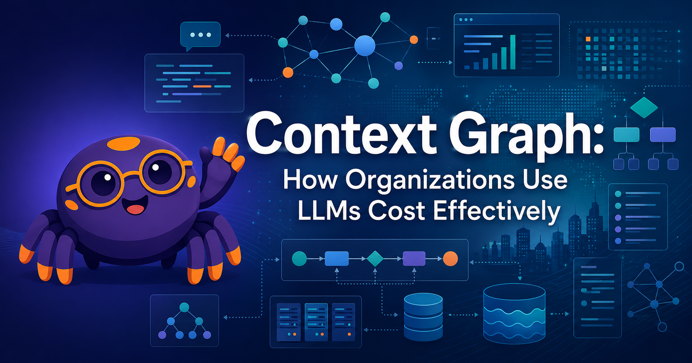

# Welcome

<figure markdown>
  { width="100%" }
</figure>

Welcome to **Context Graph: How Organizations Use LLMs Cost Effectively**.

## About This Book

Large organizations want to use large language models (LLMs) to answer
questions and generate accurate content, but the models themselves know
nothing about the organization. The missing piece is **context** —
the right slice of enterprise knowledge, delivered into the prompt at the
right moment, in the fewest tokens.

This book is about **context graphs**: enterprise graph data structures
designed to assemble that compact, high-value context. Context graphs are
structured, persistent records of product data, customer data, ontologies,
and **decision traces** — capturing not just *what* happened inside an
enterprise, but *why* it happened, *who* approved it, and *which
precedents* justified it.

The focus throughout the book is **token efficiency and quality of content
returned from an LLM**. Every modeling decision, retrieval pattern, and
architectural choice is evaluated against that pair of constraints.

## Who This Book Is For

This textbook is written for three overlapping groups:

- **Enterprise architects and senior engineers** designing AI-powered
  systems who need a principled approach to organizational memory and
  context management.
- **AI/ML practitioners and data engineers** building LLM-powered
  applications and struggling with hallucinations, missing context, and
  poor decision quality in agent workflows.
- **Technical product managers and founders** building or evaluating
  products in the enterprise AI space who want a framework for where
  context graphs create durable competitive advantage.

The book assumes comfort reading technical content and some exposure to
software systems. It does **not** require a deep background in machine
learning or graph databases — knowledge graphs, labeled property graphs,
and formal ontologies are all introduced from first principles.

## How to Use This Book

Use the navigation menu on the left to explore:

- **[Chapters](chapters/index.md)** — the main educational content, 22 chapters
  in dependency order from knowledge graphs through context graph deployment.
- **[Learning Graph](learning-graph/index.md)** — an interactive concept
  visualization showing how every idea in the book depends on the ones
  before it.
- **[MicroSims](sims/index.md)** — interactive simulations for hands-on
  learning, embeddable as iframes inside any chapter.
- **[Course Description](course-description.md)** — the seed document and
  Bloom's-taxonomy learning outcomes for the whole book.
- **[About](about.md)** — audience, prerequisites, and how to read the book.

## Getting Started

Start with [Chapter 1: Knowledge Graphs and LPGs](chapters/01-knowledge-graphs-lpg/index.md)
to build the graph-modeling foundation the rest of the book stands on.
