# MicroSims

MicroSims are small, interactive educational simulations — each one focused on
a single concept. They live under `docs/sims/<sim-name>/` and are embedded
into chapters via iframes.

New MicroSims can be created with the `microsim-generator` skill, which routes
to the appropriate library (p5.js, Chart.js, vis-network, Mermaid, Leaflet,
Plotly, Venn.js).

## Catalog

-   __[Data Model Comparison Explorer](data-model-comparison/index.md)__

    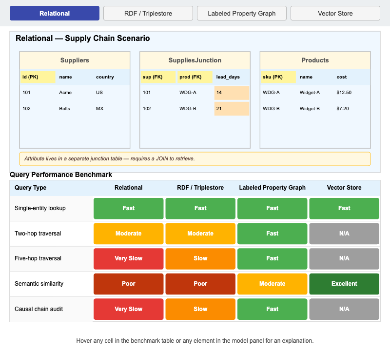

    Compare Relational, RDF, LPG, and Vector Store data models side-by-side
    with a 5×4 query performance benchmark. **Chapter 1 · p5.js**

-   __[Graph Traversal Explorer](graph-traversal-explorer/index.md)__

    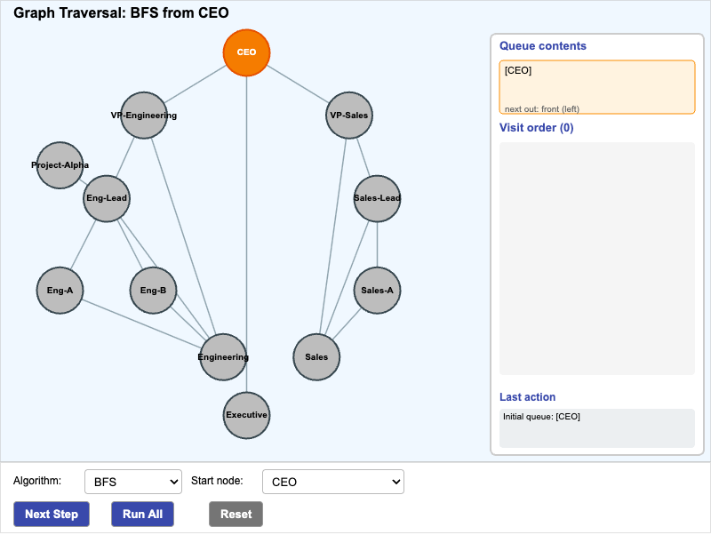

    Step through BFS and DFS on a 12-node enterprise org graph; watch the
    queue/stack and visit order build up. **Chapter 1 · p5.js**

-   __[Interactive LPG Explorer](lpg-explorer/index.md)__

    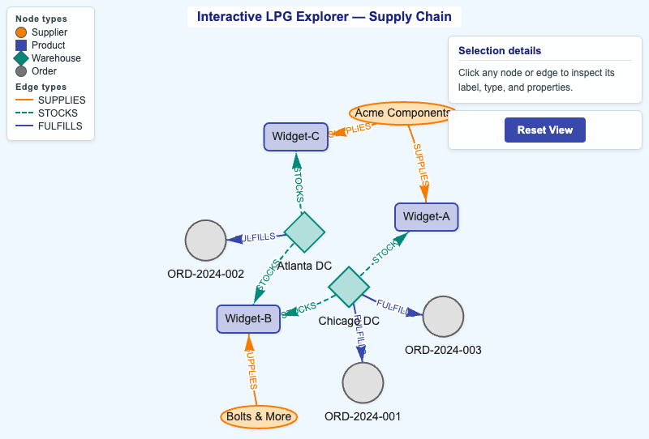

    Click nodes and edges in a supply-chain Labeled Property Graph to inspect
    labels, types, and properties. **Chapter 1 · vis-network**

-   __[Multi-Hop Query Performance](multi-hop-performance/index.md)__

    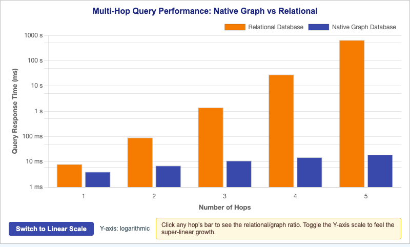

    Compare native graph (linear) vs relational (super-linear) query latency
    across 1–5 hops; toggle log/linear scale. **Chapter 1 · Chart.js**

-   __[Query Federation Flow](query-federation-flow/index.md)__

    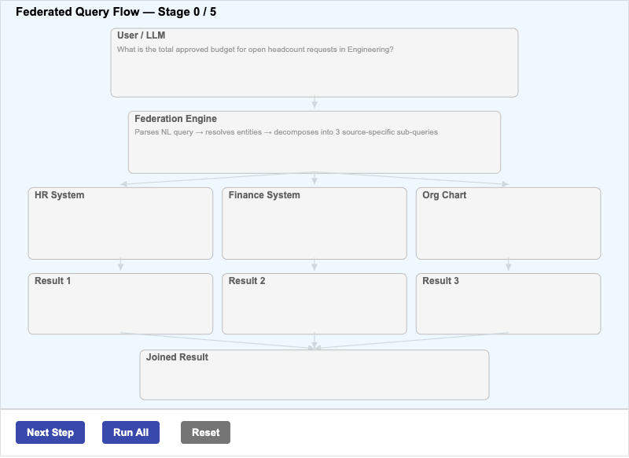

    Step through a federated business query as it's decomposed into SQL, REST,
    and graph sub-queries, then re-joined. **Chapter 2 · p5.js**

-   __[Semantic Consistency Explorer](semantic-consistency-explorer/index.md)__

    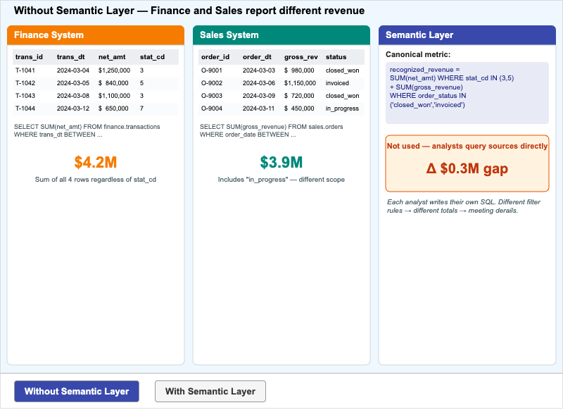

    Compare Finance and Sales revenue numbers and see how a semantic layer
    reconciles them into one canonical metric. **Chapter 2 · p5.js**

-   __[Semantic Layer Architecture](semantic-layer-architecture/index.md)__

    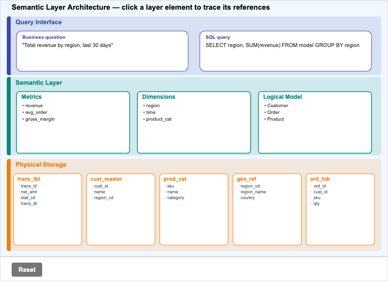

    Click any element across the Query Interface, Semantic Layer, and Physical
    Storage bands to trace its references. **Chapter 2 · p5.js**

-   __[Metadata Catalog to Context Graph Flow](catalog-to-context-graph-flow/index.md)__

    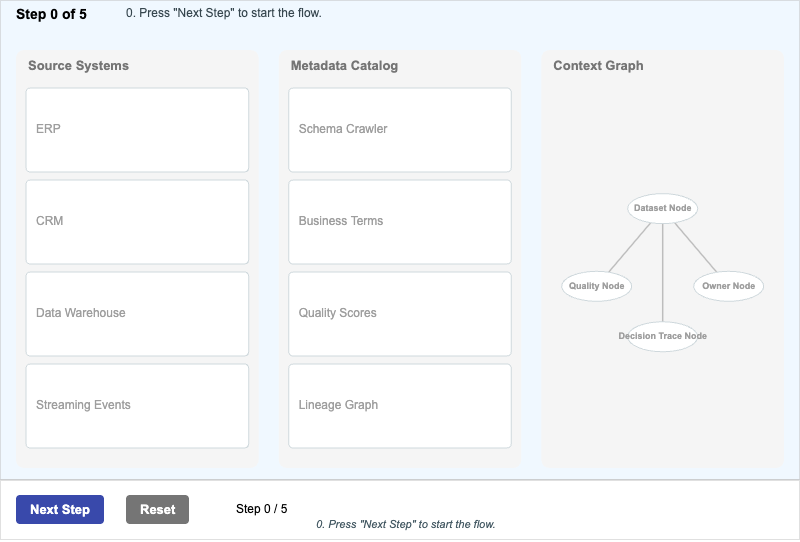

    Step through how metadata moves from source systems through a catalog
    platform and into a context graph. **Chapter 3 · p5.js**

-   __[Differential Privacy Explorer](differential-privacy-explorer/index.md)__

    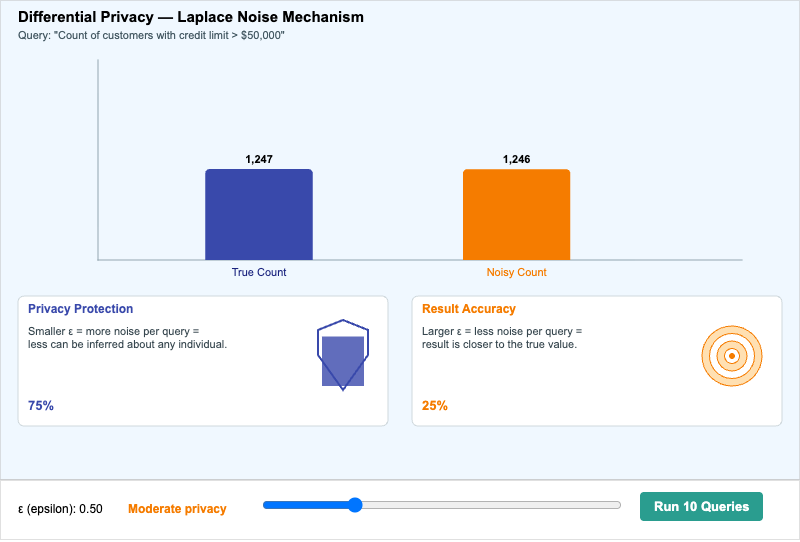

    Drag the epsilon slider and feel the trade-off between privacy and result
    accuracy via Laplace-noise simulation. **Chapter 3 · p5.js**

-   __[Governance Framework Concept Map](governance-concept-map/index.md)__

    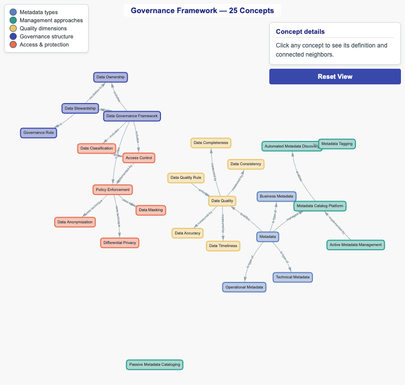

    Explore 25 governance concepts in five color-coded clusters; click any
    concept to see its definition and connections. **Chapter 3 · vis-network**

-   __[Governance Role Graph](governance-role-graph/index.md)__

    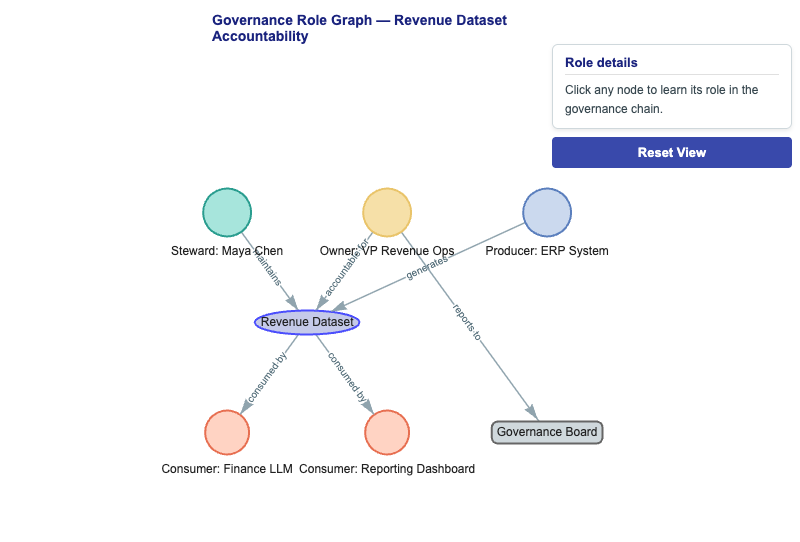

    Trace the accountability chain from a dataset to steward, owner,
    producer, consumers, and the governance board. **Chapter 3 · vis-network**

-   __[Three Metadata Layers](three-metadata-layers/index.md)__

    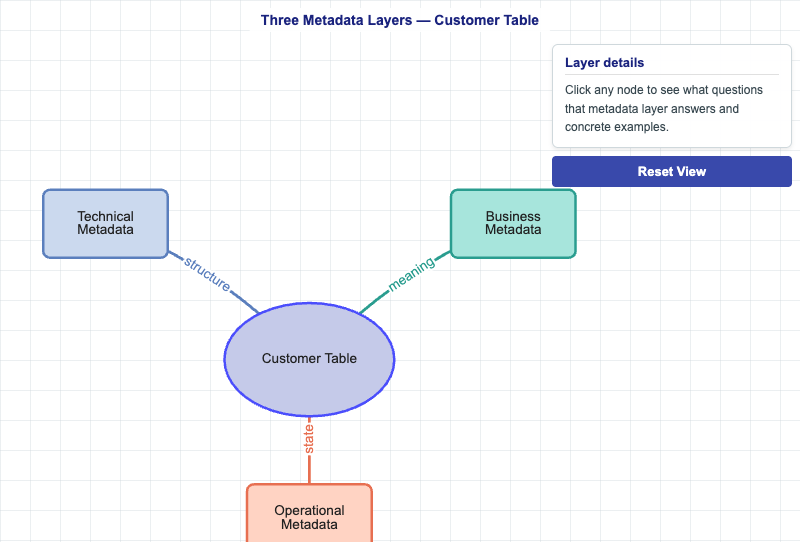

    Radial diagram showing technical, business, and operational metadata
    attached to a single Customer Table. **Chapter 3 · vis-network**

-   __[Graph ETL Pipeline Stages](graph-etl-pipeline/index.md)__

    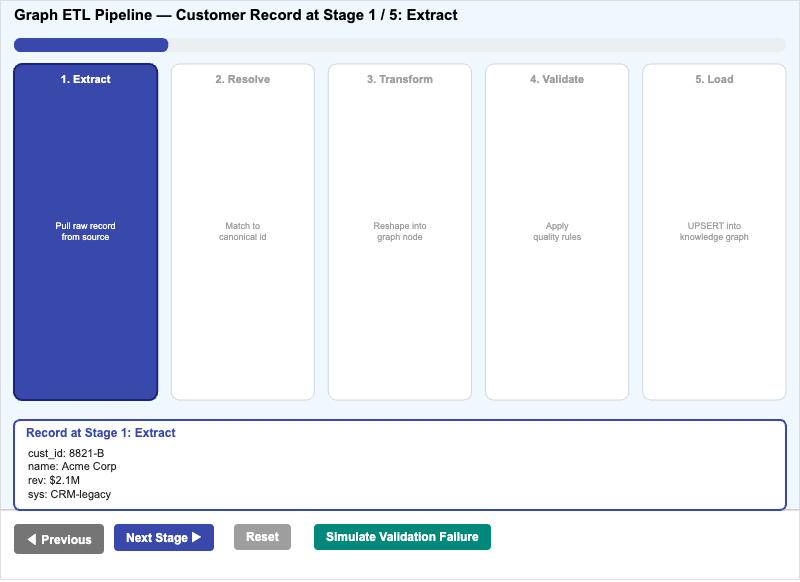

    Step a Customer record through Extract → Resolve → Transform → Validate
    → Load with a failure-mode toggle. **Chapter 4 · p5.js**

-   __[Hub-and-Spoke vs Federated](hub-spoke-vs-federated/index.md)__

    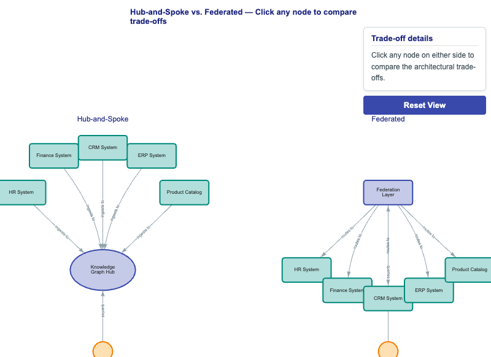

    Side-by-side knowledge-graph architectures; click any node to surface
    the trade-offs each side encodes. **Chapter 4 · vis-network**

-   __[Taxonomy vs Ontology](taxonomy-vs-ontology/index.md)__

    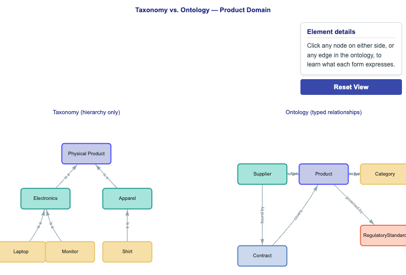

    Contrast a hierarchy-only taxonomy with a richly-typed ontology for
    the same product domain. **Chapter 4 · vis-network**

-   __[IE Pipeline to Graph](ie-pipeline-to-graph/index.md)__

    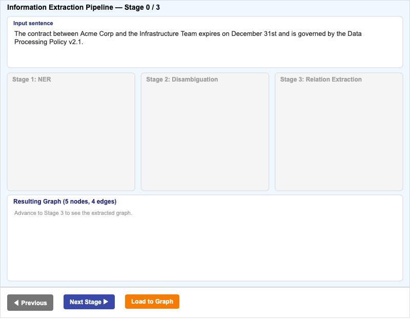

    Walk an unstructured sentence through NER → disambiguation → relation
    extraction into a small RDF-style graph. **Chapter 5 · p5.js**

-   __[KG Embedding Space Explorer](kg-embedding-explorer/index.md)__

    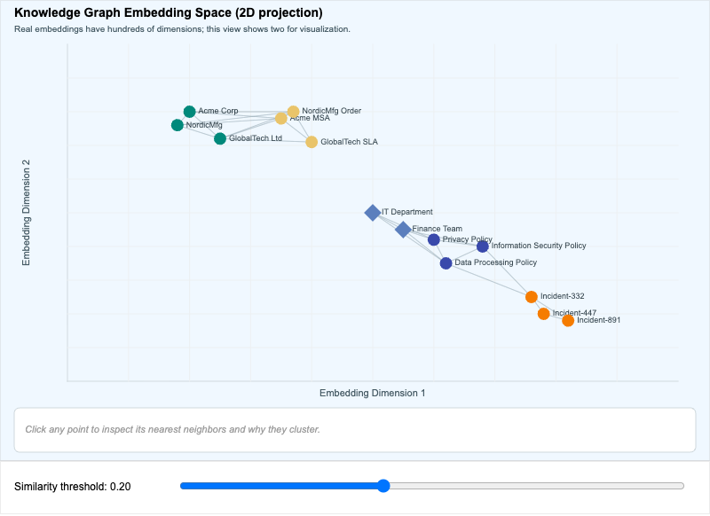

    Click points in a 2D embedding scatter to see nearest neighbors and
    cluster meaning; slide the similarity threshold. **Chapter 5 · p5.js**

-   __[PageRank Supplier Graph](pagerank-supplier-graph/index.md)__

    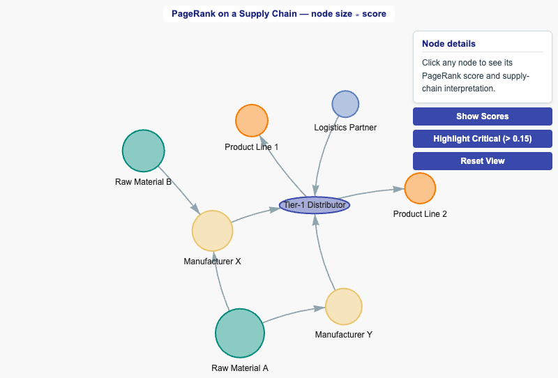

    Eight-node supply chain with node size proportional to PageRank score;
    click any node for its risk interpretation. **Chapter 5 · vis-network**

-   __[ISO 11179 Hierarchy](iso11179-hierarchy/index.md)__

    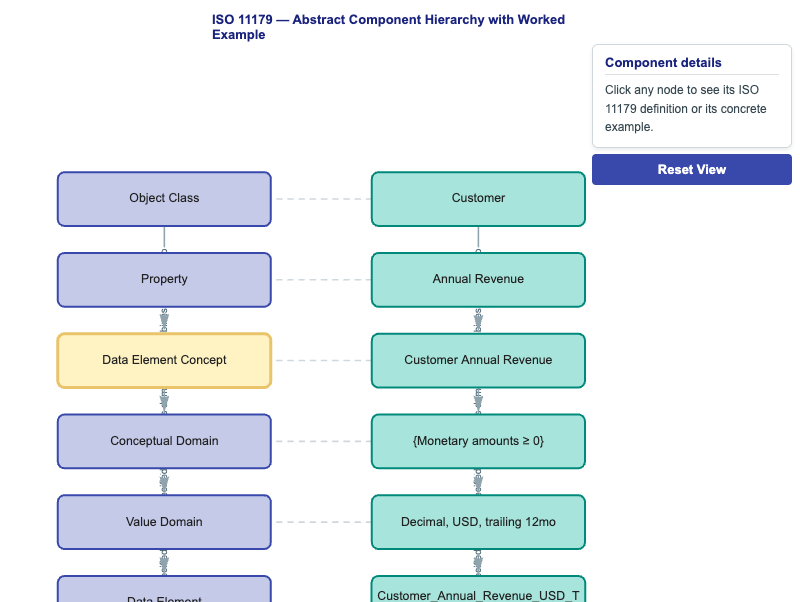

    Six-level ISO 11179 component hierarchy alongside a worked Customer
    Annual Revenue example. **Chapter 6 · vis-network**

-   __[Registry API Retrieval Flow](registry-api-retrieval/index.md)__

    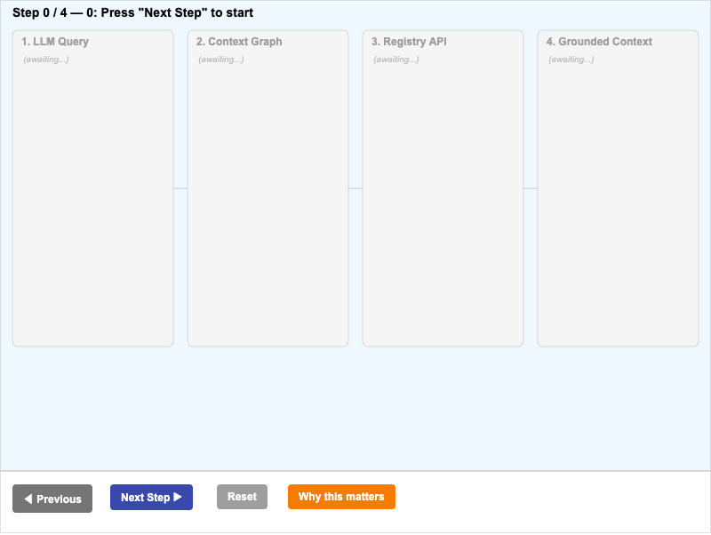

    Trace a query through context graph + registry API to produce a
    grounded LLM payload with units and version. **Chapter 6 · p5.js**

-   __[Registry vs Catalog Architecture](registry-vs-catalog/index.md)__

    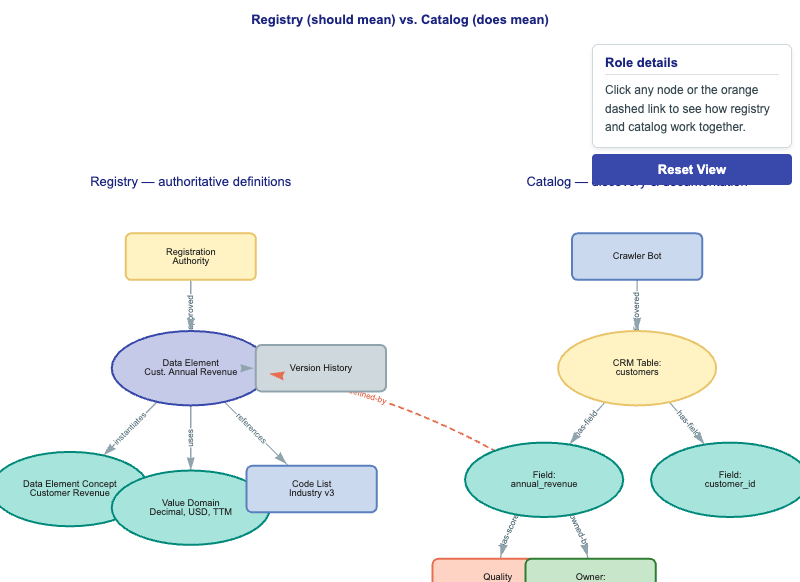

    Contrast an authoritative registry with a discovery-oriented catalog;
    follow the dashed integration link between them. **Chapter 6 · vis-network**

-   __[Event Sourcing Architecture](event-sourcing-context-graph/index.md)__

    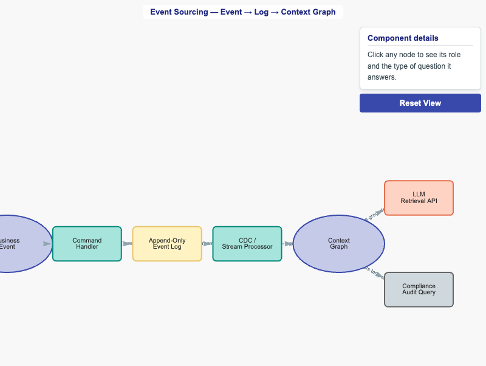

    Trace a business event through command handler, append-only log,
    stream processor, and into the context graph. **Chapter 7 · vis-network**

-   __[Lineage vs Provenance](lineage-vs-provenance/index.md)__

    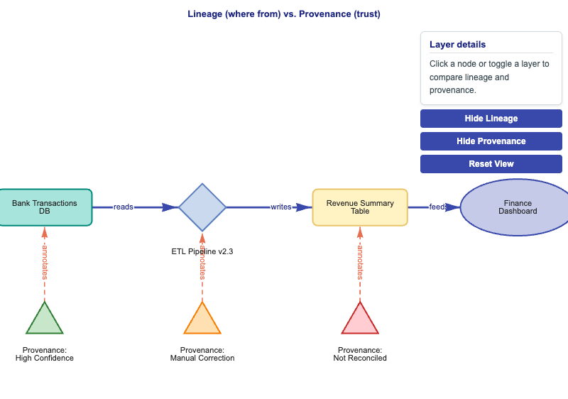

    Toggle lineage (where data came from) and provenance (whether to trust
    it) layers in the same pipeline graph. **Chapter 7 · vis-network**

-   __[Process Discovery Sim](process-discovery-sim/index.md)__

    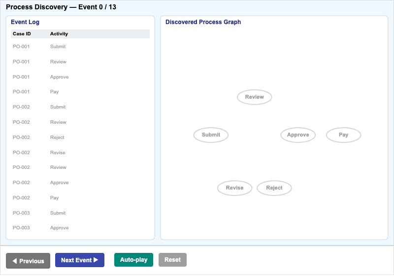

    Watch a directly-follows graph build itself from an event log of three
    purchase-order cases, flagging deviations in orange. **Chapter 7 · p5.js**

-   __[Context Failure Modes](context-failure-modes/index.md)__

    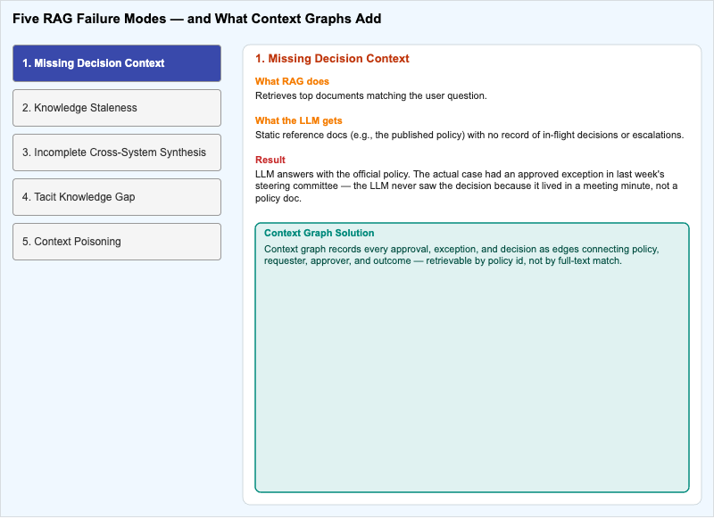

    Click through five RAG failure modes and the context-graph fix for each:
    decision context, staleness, synthesis, tacit knowledge, poisoning. **Chapter 8 · p5.js**

-   __[Four Missing Layers](four-missing-layers/index.md)__

    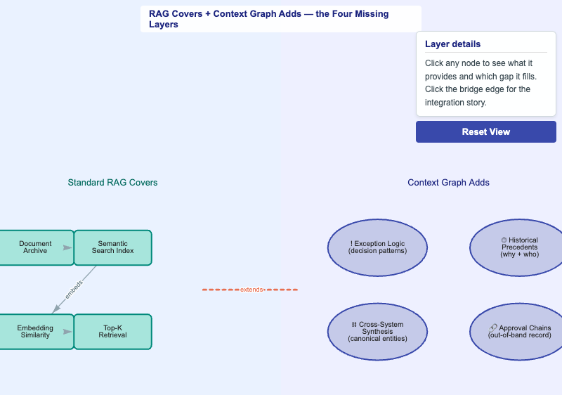

    Two-panel diagram contrasting what RAG covers with the four
    organizational layers context graphs add. **Chapter 8 · vis-network**

-   __[Context Graph Schema](context-graph-schema/index.md)__

    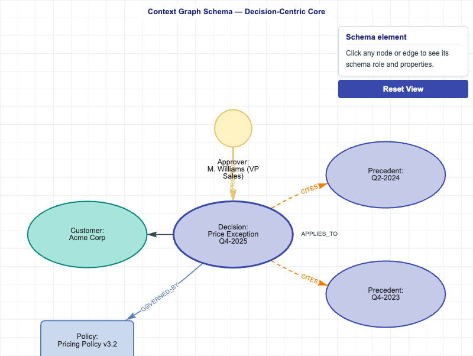

    Inspect the four core schema elements of a context graph — Decision
    Node, Entity Link, Approval Edge, Precedent Link. **Chapter 9 · vis-network**

-   __[Five Knowledge Layers](five-knowledge-layers/index.md)__

    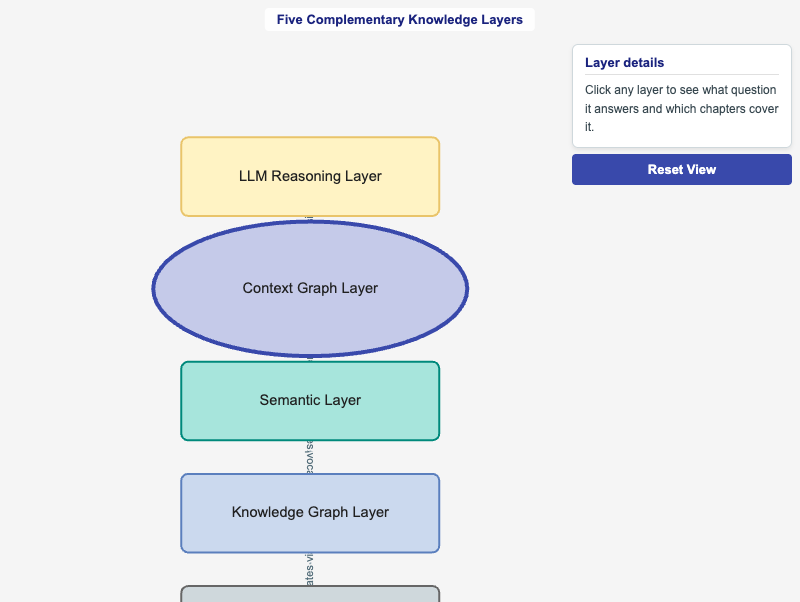

    Five-layer enterprise AI stack: LLM Reasoning → Context Graph →
    Semantic → Knowledge Graph → Raw Data. **Chapter 9 · vis-network**

-   __[LLM Evaluation Pipeline](llm-evaluation-pipeline/index.md)__

    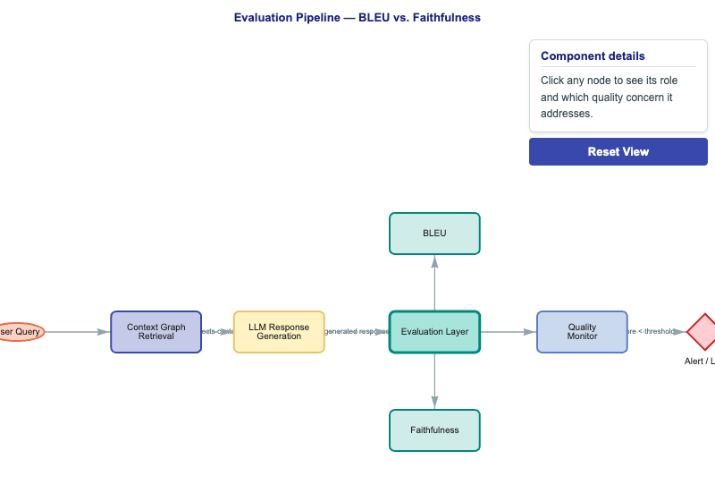

    Compare BLEU and Faithfulness evaluators; both feed a quality monitor
    that fires alerts when scores drop. **Chapter 10 · vis-network**

-   __[Prompt Anatomy Explorer](prompt-anatomy-explorer/index.md)__

    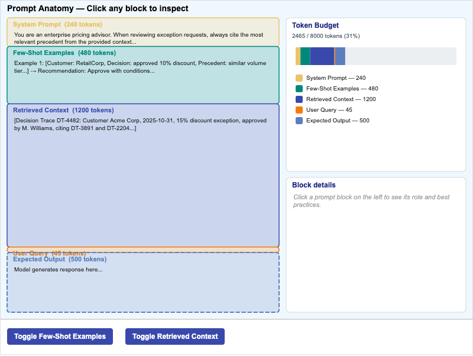

    Stack of system prompt + few-shot + context + query blocks with a
    live token-budget chart and toggle buttons. **Chapter 10 · p5.js**

-   __[Decision Trace Full Schema](decision-trace-full-schema/index.md)__

    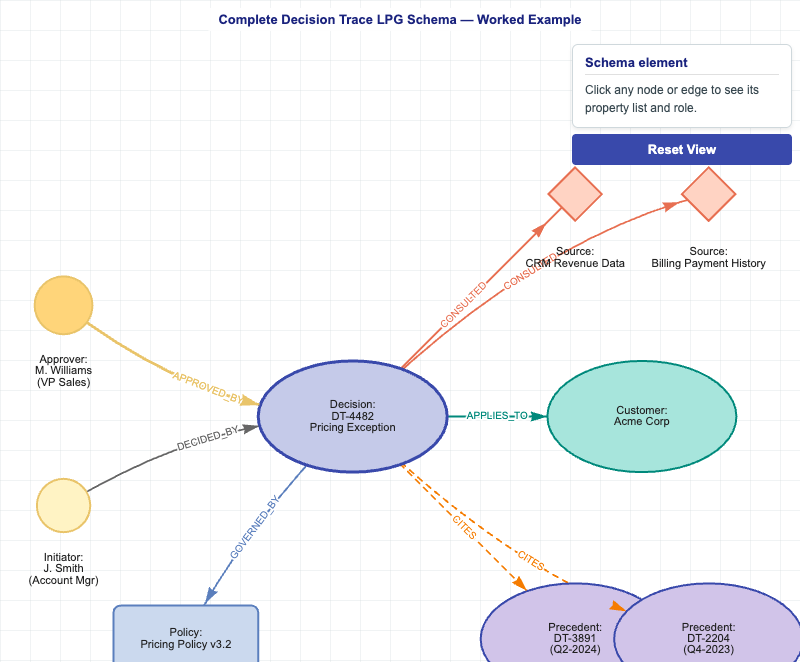

    Fully-populated decision trace showing initiator, approver, customer,
    policy, precedents, and source data nodes with all edge types. **Chapter 11 · vis-network**

-   __[Precedent Chain Pattern](precedent-chain-pattern/index.md)__

    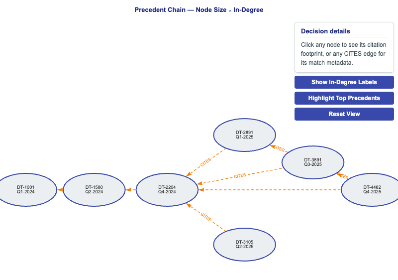

    Seven-decision citation chain with node size proportional to in-degree;
    toggle degree labels and top-precedent highlighting. **Chapter 11 · vis-network**

-   __[Incumbent Gap Analysis](incumbent-gap-analysis/index.md)__

    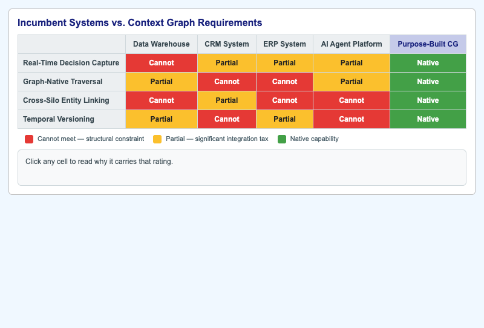

    4×5 ratings grid scoring incumbent systems (Data Warehouse, CRM, ERP,
    AI Agent, Purpose-Built CG) against the four context-graph requirements. **Chapter 12 · HTML**

-   __[Bitemporal Explorer](bitemporal-explorer/index.md)__

    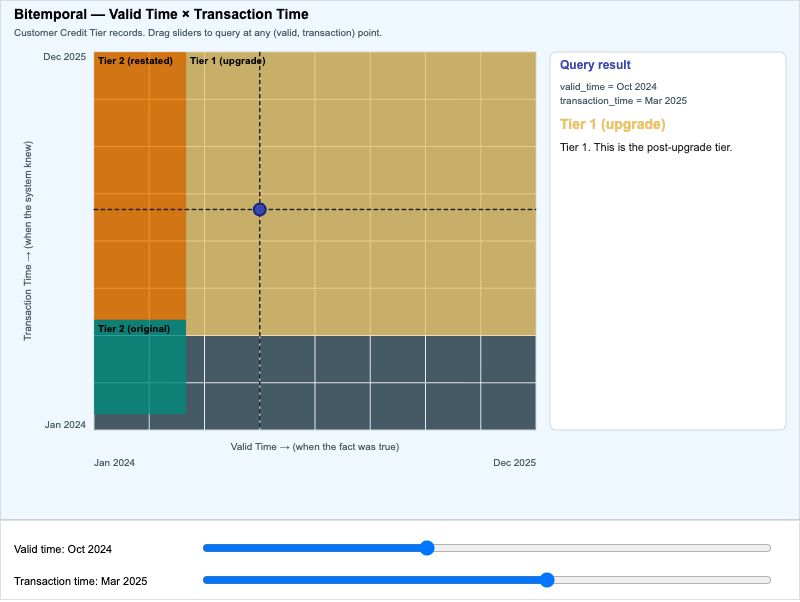

    2D time grid with crosshair sliders showing valid-time × transaction-time
    queries against three credit-tier records. **Chapter 13 · p5.js**

-   __[Subgraph Extraction](subgraph-extraction/index.md)__

    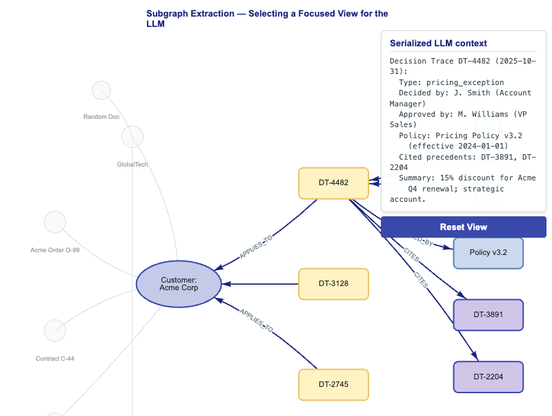

    Highlighted subgraph plus prose serialization showing how a focused
    context is assembled for the LLM from a full graph. **Chapter 13 · vis-network**

-   __[Context Budget Visualizer](context-budget-visualizer/index.md)__

    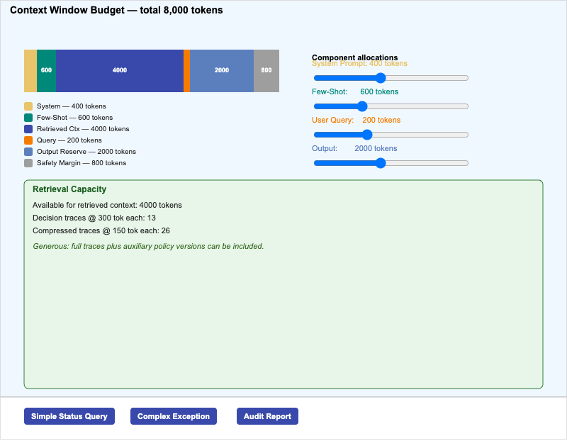

    Allocate 8K tokens across prompt, few-shot, retrieved context, query,
    and output reservation with three use-case presets. **Chapter 14 · p5.js**

-   __[Hybrid Retrieval Pipeline](hybrid-retrieval-pipeline/index.md)__

    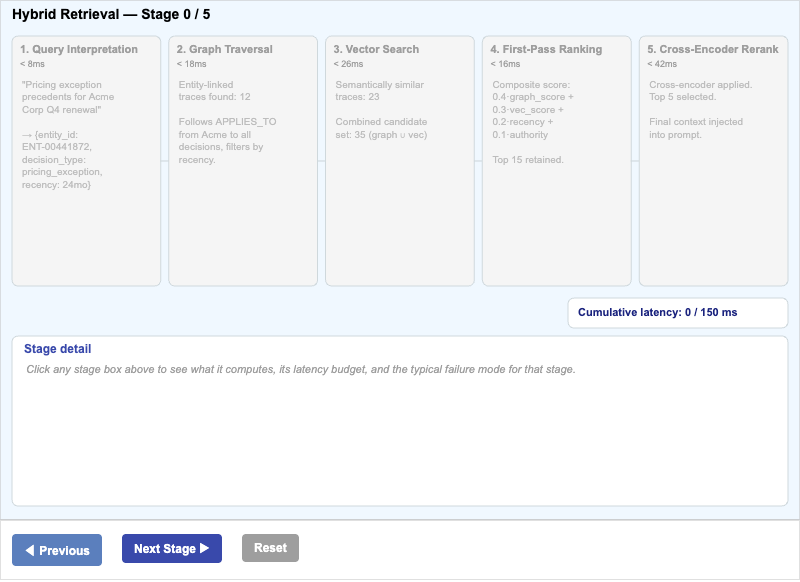

    Step through Query Interp → Graph Traversal → Vector Search → Composite
    Rank → Cross-Encoder Rerank with per-stage latency budget. **Chapter 14 · p5.js**

-   __[Ingestion Pipeline Architecture](ingestion-pipeline-architecture/index.md)__

    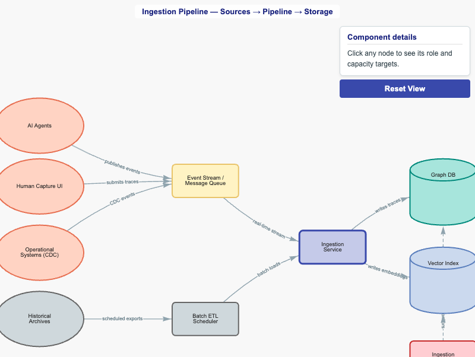

    Sources (agents, humans, CDC, batch) → event stream + batch ETL →
    ingestion service → graph DB + vector index, with monitoring. **Chapter 15 · vis-network**

-   __[Agent Memory Architecture](agent-memory-architecture/index.md)__

    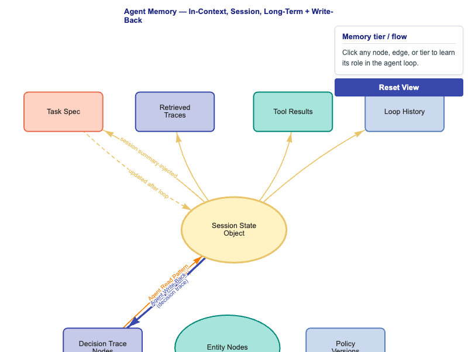

    Three-tier memory: in-context (ephemeral), session (per-loop), long-term
    (context graph) with the agent write-back loop. **Chapter 16 · vis-network**

-   __[Graduated Autonomy Model](graduated-autonomy-model/index.md)__

    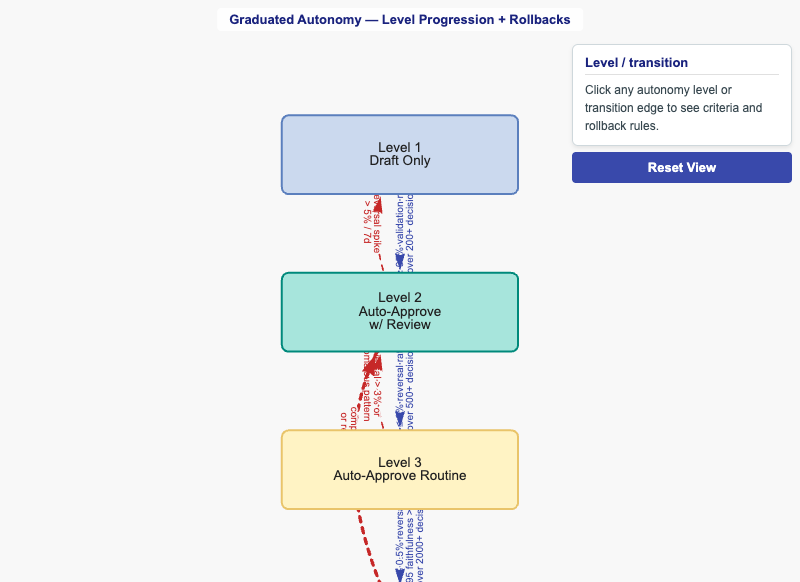

    Four-level autonomy ladder (Draft → Full Autonomy) with promotion
    criteria and rollback rules; click any transition to see the rationale. **Chapter 16 · vis-network**

-   __[Cross-Domain Use Cases](cross-domain-use-case-comparison/index.md)__

    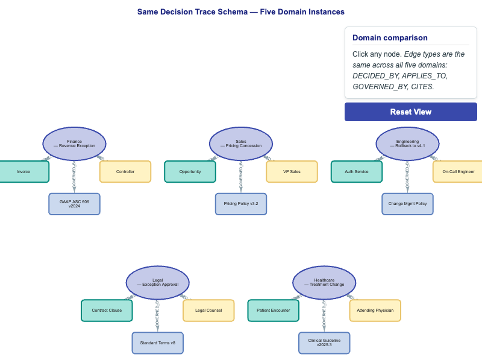

    Same decision trace schema instantiated across Finance, Sales,
    Engineering, Legal, and Healthcare. **Chapter 17 · vis-network**

-   __[Incident Response Graph](incident-response-graph/index.md)__

    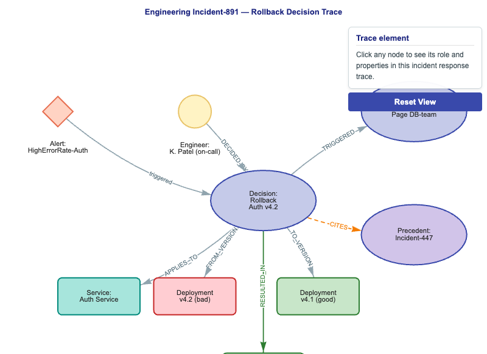

    Fully-instantiated engineering incident trace: alert → rollback decision
    → service/deployment entities → resolution. **Chapter 17 · vis-network**

-   __[Audit Trail Architecture](audit-trail-architecture/index.md)__

    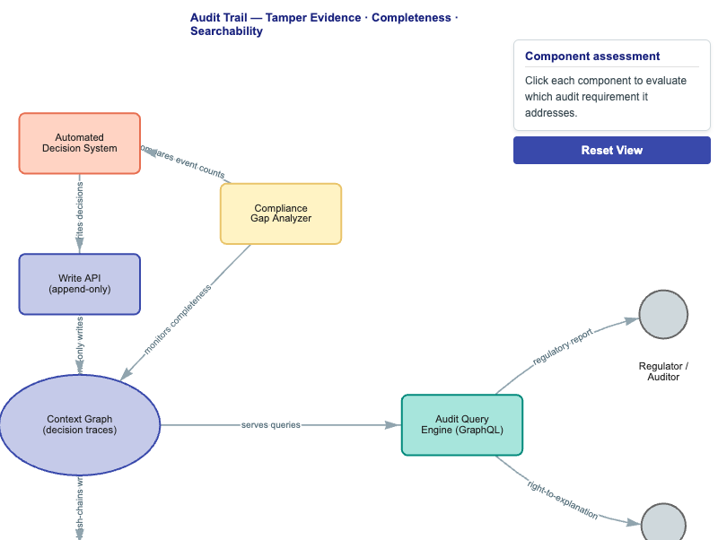

    Components meeting three audit requirements (tamper evidence, temporal
    completeness, searchability) for regulated context graph systems. **Chapter 18 · vis-network**

-   __[Compliance Lifecycle](compliance-lifecycle/index.md)__

    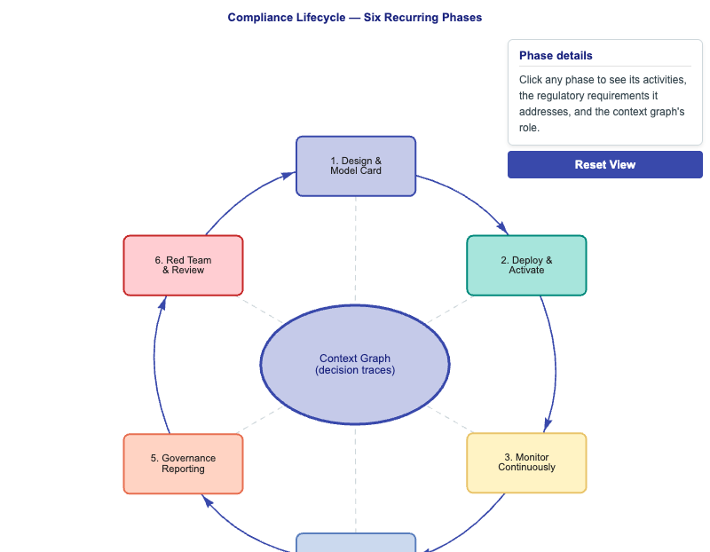

    Six-phase circular lifecycle (Design → Deploy → Monitor → Audit →
    Govern → Red Team) around the context graph. **Chapter 18 · vis-network**

